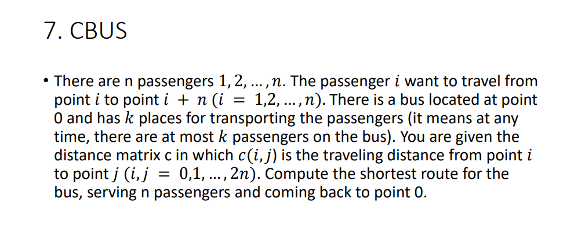

# CBUS Optimization problem

## Getting started
This is our group's implementation of various algorithms to solve the CBUS
Optimization problem for Fundamentals of Optimization class. The problem
is described in the following section.

Get this repository on your local machine by running the following command
in Git Bash.
```bash
git clone https://github.com/brandon-mai/optimization-capstone-project.git
```
Specific instructions for running algorithms are in the following sections.
<br>
<br>

## Problem description

<br>
<br>

## Proposed solution
<table>
    <thead>
        <tr>
            <th>Algorithm family</th>
            <th>Algorithm</th>
            <th>File</th>
        </tr>
    </thead>
    <tbody>
        <tr>
            <td rowspan=3>Exact</td>
            <td>Backtracking</td>
            <td>BnB.py</td>
        </tr>
        <tr>
            <td>Branch and Bound</td>
            <td>BnB.py</td>
        </tr>
        <tr>
            <td>Constraint programming</td>
            <td>CP.py</td>
        </tr>
        <tr>
            <td rowspan=3>Heuristics</td>
            <td>Nearest Neighbor</td>
            <td>NearestNeighbor.py</td>
        </tr>
        <tr>
            <td>Hill Climbing</td>
            <td>HillClimbing.py</td>
        </tr>
        <tr>
            <td>Beam search</td>
            <td>BeamSearch.py</td>
        </tr>
        <tr>
            <td rowspan=3>Metaheuristics</td>
            <td>Tabu search</td>
            <td>TabuSearch.py</td>
        </tr>
        <tr>
            <td>Tabu Beam</td>
            <td>TabuBeam.py</td>
        </tr>
        <tr>
            <td>Simulated Annealing</td>
            <td>SimulatedAnnealing.py</td>
        </tr>
    </tbody>
</table>

To try out the algorithms, head to respective files and change the
parameters in the `main()` function accordingly. Parameters are of
the following:
- Problem file name: files located in `datasets/` folder. Head over
there to see the format of the files, or create your own.
- Algorithm-specific parameters: see the respective files for more info.

```python
def main():
    # N, K, distance_matrix = import_data_input()
    N, K, distance_matrix = import_data_file('dataset/input100.txt')

    sol = Solver(N, K, distance_matrix)
    sol.solve_simulated_annealing(initial_temp=5000, alpha=0.99, time_limit=180)
    sol.print_solution()
```

Example of a typical `main()` function in the above files.
<br>
<br>

## Results and comparison
Detailed results and comparison can be found in our PDF report in the
`attachments/` folder.